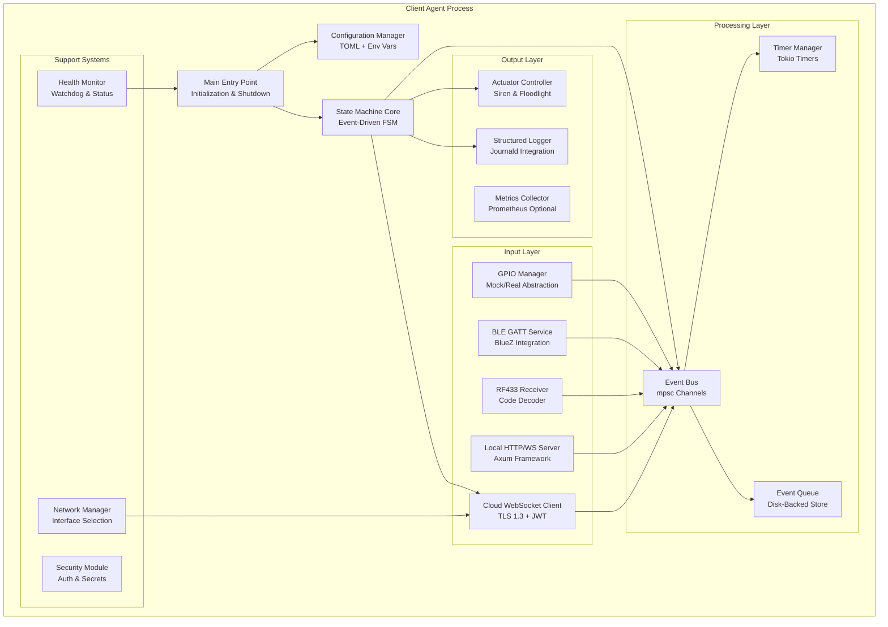
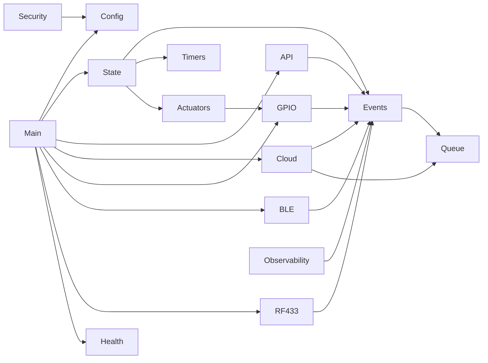
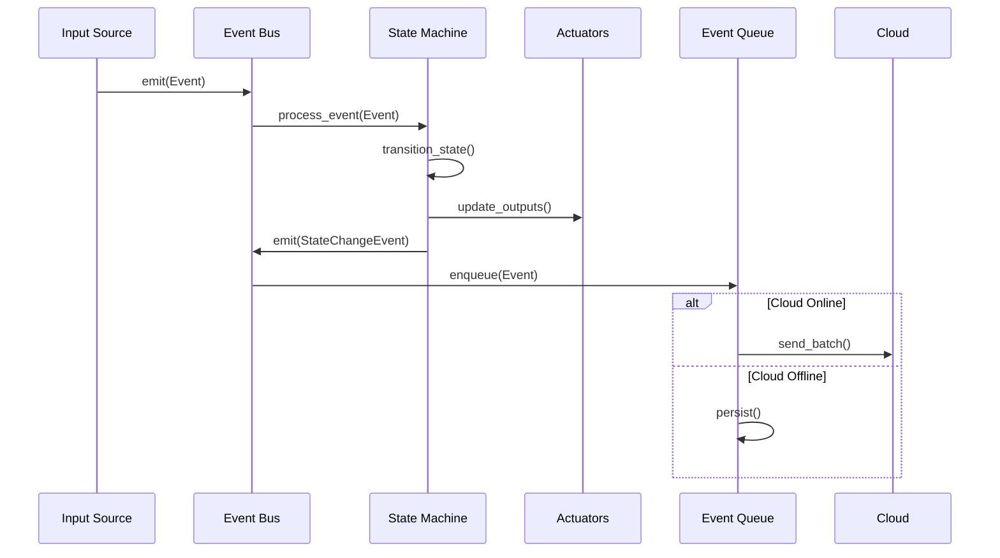
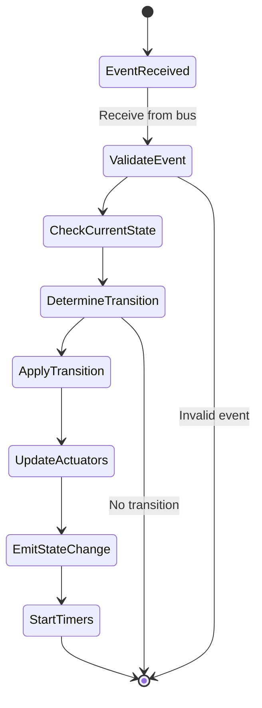
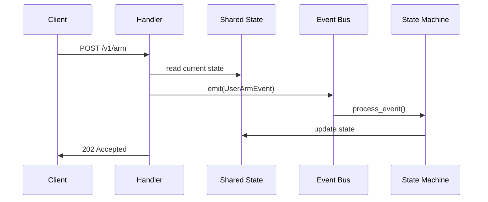

# Pi Door Security Client Agent - Implementation Architecture Plan

Version: 0.1.0  
Status: Architecture Planning  
Date: 2025-01-07  
Target: Complete system implementation with mock GPIO support

---

## 1. Executive Summary

This document outlines the implementation architecture for the Pi Door Security client agent based on [`refined_specs.md`](refined_specs.md:1). The system will be built as a complete, production-ready Rust application with:

- Mock GPIO layer for development on non-Pi hardware
- Event-driven architecture with async/await
- Modular design for testability and maintainability
- Full specification compliance in a single implementation phase

**Key Implementation Strategy**: Build all components concurrently with clear module boundaries and interfaces, allowing parallel development and testing.

---

## 2. System Architecture Overview

### 2.1 High-Level Component Diagram



### 2.2 Core Design Principles

1. **Event-Driven Architecture**: All inputs generate events; state machine processes events
2. **Async-First**: Tokio runtime for all I/O operations
3. **Fail-Safe**: Actuators default to safe state on panic/crash
4. **Testability**: Mock implementations for all hardware interfaces
5. **Modularity**: Clear boundaries between components via traits
6. **Durability**: Persist critical state and queue events offline

---

## 3. Module Structure and Organization

### 3.1 Project Layout

```
client_server/
├── Cargo.toml                  # Dependencies and build config
├── src/
│   ├── main.rs                 # Entry point, initialization, signal handling
│   ├── lib.rs                  # Public library interface for testing
│   │
│   ├── config/
│   │   ├── mod.rs              # Config manager and loader
│   │   ├── schema.rs           # Config structs with serde
│   │   └── validation.rs       # Config validation logic
│   │
│   ├── state/
│   │   ├── mod.rs              # State machine core
│   │   ├── machine.rs          # FSM implementation
│   │   ├── transitions.rs      # State transition rules
│   │   └── shared.rs           # Shared state with Arc<RwLock<>>
│   │
│   ├── events/
│   │   ├── mod.rs              # Event types and bus
│   │   ├── types.rs            # Event enum definitions
│   │   ├── bus.rs              # Event distribution via mpsc
│   │   └── queue.rs            # Disk-backed event queue
│   │
│   ├── timers/
│   │   ├── mod.rs              # Timer management
│   │   └── manager.rs          # Timer spawning and cancellation
│   │
│   ├── gpio/
│   │   ├── mod.rs              # GPIO abstraction
│   │   ├── traits.rs           # GpioController trait
│   │   ├── mock.rs             # Mock implementation for testing
│   │   └── rppal.rs            # Real Pi implementation with rppal
│   │
│   ├── actuators/
│   │   ├── mod.rs              # Actuator controller
│   │   └── controller.rs       # Siren and floodlight logic
│   │
│   ├── api/
│   │   ├── mod.rs              # HTTP/WS server
│   │   ├── server.rs           # Axum app setup
│   │   ├── handlers/
│   │   │   ├── mod.rs
│   │   │   ├── health.rs       # GET /v1/health
│   │   │   ├── status.rs       # GET /v1/status
│   │   │   ├── arm_disarm.rs   # POST /v1/arm, /v1/disarm
│   │   │   ├── actuators.rs    # POST /v1/siren, /v1/floodlight
│   │   │   ├── config.rs       # GET/PUT /v1/config
│   │   │   ├── ble.rs          # POST /v1/ble/pairing
│   │   │   └── websocket.rs    # GET /v1/ws
│   │   ├── models.rs           # Request/response types
│   │   └── error.rs            # API error types
│   │
│   ├── cloud/
│   │   ├── mod.rs              # Cloud WebSocket client
│   │   ├── client.rs           # WS connection manager
│   │   ├── auth.rs             # JWT handling
│   │   └── reconnect.rs        # Backoff and retry logic
│   │
│   ├── ble/
│   │   ├── mod.rs              # BLE GATT service
│   │   ├── service.rs          # GATT service implementation
│   │   ├── characteristics.rs  # Command and status characteristics
│   │   └── pairing.rs          # Pairing mode management
│   │
│   ├── rf433/
│   │   ├── mod.rs              # RF receiver integration
│   │   ├── decoder.rs          # EV1527/PT2262 decoder
│   │   └── mapper.rs           # Code to action mapping
│   │
│   ├── network/
│   │   ├── mod.rs              # Network redundancy
│   │   └── manager.rs          # Interface selection logic
│   │
│   ├── security/
│   │   ├── mod.rs              # Security utilities
│   │   ├── secrets.rs          # Secret loading and handling
│   │   └── privileges.rs       # Privilege dropping
│   │
│   ├── observability/
│   │   ├── mod.rs              # Logging and metrics
│   │   ├── logger.rs           # Structured logging setup
│   │   └── metrics.rs          # Prometheus metrics (optional)
│   │
│   └── health/
│       ├── mod.rs              # Health monitoring
│       └── watchdog.rs         # Systemd watchdog integration
│
├── tests/
│   ├── integration/
│   │   ├── state_machine.rs    # State machine integration tests
│   │   ├── api.rs              # HTTP/WS API tests
│   │   └── cloud.rs            # Cloud connection tests
│   └── common/
│       └── mod.rs              # Test utilities and fixtures
│
├── examples/
│   ├── mock_gpio_demo.rs       # Demo with mock GPIO
│   └── config_examples/        # Sample configurations
│
└── docs/
    ├── raw_specs.md
    ├── refined_specs.md
    └── implementation_plan.md  # This document
```

### 3.2 Module Dependencies and Interfaces



---

## 4. Key Design Decisions

### 4.1 State Management Strategy

**Decision**: Use `Arc<RwLock<SharedState>>` for shared state across async tasks

**Rationale**:
- Multiple components need read access to current state
- State updates are infrequent relative to reads
- RwLock allows concurrent reads with exclusive writes
- Arc enables sharing across async boundaries

**Alternatives Considered**:
- Actor model (overkill for this use case)
- Mutex (less efficient for read-heavy workload)
- Message passing only (harder to query current state)

**Implementation**:
```rust
pub struct SharedState {
    pub current_state: AlarmState,
    pub door_open: bool,
    pub actuators: ActuatorState,
    pub connectivity: ConnectivityState,
    pub timers: TimerState,
    pub last_events: VecDeque<Event>,
}

pub type AppState = Arc<RwLock<SharedState>>;
```

### 4.2 Event Bus Architecture

**Decision**: Use `tokio::sync::mpsc` channels for event distribution

**Rationale**:
- Unbounded channels for input events (backpressure at source)
- Bounded channels for critical paths (prevent memory exhaustion)
- Built-in async support with Tokio
- Single producer, multiple consumer pattern via broadcast for fanout

**Implementation**:
```rust
pub struct EventBus {
    tx: mpsc::UnboundedSender<Event>,
    rx: mpsc::UnboundedReceiver<Event>,
    subscribers: Vec<broadcast::Sender<Event>>,
}
```

### 4.3 GPIO Abstraction

**Decision**: Trait-based abstraction with compile-time feature selection

**Rationale**:
- Allows development on non-Pi hardware
- Enables comprehensive testing without hardware
- Production builds use real GPIO with rppal crate
- No runtime overhead in production

**Implementation**:
```rust
#[async_trait]
pub trait GpioController: Send + Sync {
    async fn read_door_sensor(&self) -> Result<bool>;
    async fn set_siren(&self, on: bool) -> Result<()>;
    async fn set_floodlight(&self, on: bool) -> Result<()>;
    async fn wait_for_edge(&self, pin: u8) -> Result<Edge>;
}

#[cfg(feature = "mock-gpio")]
pub type DefaultGpio = MockGpio;

#[cfg(not(feature = "mock-gpio"))]
pub type DefaultGpio = RppalGpio;
```

### 4.4 Configuration Management

**Decision**: Layered configuration with TOML base + env var overrides

**Rationale**:
- TOML is human-readable and supports complex structures
- Environment variables for secrets (12-factor app)
- Validation at load time prevents runtime errors
- Single source of truth via config struct

**Implementation**:
```rust
pub struct AppConfig {
    pub system: SystemConfig,
    pub network: NetworkConfig,
    pub http: HttpConfig,
    pub cloud: CloudConfig,
    pub gpio: GpioConfig,
    pub timers: TimerConfig,
    pub ble: BleConfig,
    pub rf433: Rf433Config,
}

impl AppConfig {
    pub fn load() -> Result<Self> {
        // 1. Load from default
        // 2. Override with /etc/pi-door-client/config.toml
        // 3. Override with environment variables
        // 4. Validate
    }
}
```

### 4.5 Cloud Event Queue Strategy

**Decision**: Disk-backed queue using `sled` embedded database

**Rationale**:
- Persistent across restarts
- ACID guarantees for event ordering
- Bounded storage with automatic pruning
- No external dependencies (no Redis/PostgreSQL required)

**Implementation**:
```rust
pub struct EventQueue {
    db: sled::Db,
    max_events: usize,
    max_age_days: u32,
}

impl EventQueue {
    pub async fn enqueue(&self, event: Event) -> Result<()> {
        // Serialize and store with timestamp key
        // Prune old events if limits exceeded
    }
    
    pub async fn dequeue_batch(&self, limit: usize) -> Result<Vec<Event>> {
        // Return oldest events first
    }
}
```

### 4.6 Error Handling Strategy

**Decision**: `anyhow` for application errors, custom types for API errors

**Rationale**:
- anyhow provides ergonomic error handling with context
- API needs structured error responses with codes
- Fail-fast during initialization, graceful degradation at runtime

**Implementation**:
```rust
// Application errors
pub type Result<T> = anyhow::Result<T>;

// API errors
#[derive(Serialize)]
pub struct ApiError {
    pub error: String,
    pub code: u16,
    pub retryable: bool,
}
```

---

## 5. Technology Stack

### 5.1 Core Dependencies

```toml
[dependencies]
# Async runtime
tokio = { version = "1.45", features = ["full"] }
tokio-util = "0.7"

# HTTP/WebSocket server
axum = { version = "0.7", features = ["ws"] }
tower = "0.5"
tower-http = { version = "0.6", features = ["trace", "timeout"] }

# Configuration
serde = { version = "1.0", features = ["derive"] }
serde_json = "1.0"
toml = "0.8"
config = "0.14"

# Cloud WebSocket client
tokio-tungstenite = { version = "0.24", features = ["native-tls"] }
native-tls = "0.2"

# Event persistence
sled = "0.34"

# GPIO (conditional)
rppal = { version = "0.19", optional = true }

# BLE
bluer = { version = "0.17", features = ["bluetoothd"] }

# RF433
rppal-pud = { version = "0.3", optional = true }

# JWT
jsonwebtoken = "9.3"

# Logging
tracing = "0.1"
tracing-subscriber = { version = "0.3", features = ["json", "env-filter"] }
tracing-journald = "0.3"

# Time handling
chrono = { version = "0.4", features = ["serde"] }

# Error handling
anyhow = "1.0"
thiserror = "1.0"

# UUID generation
uuid = { version = "1.11", features = ["v4", "serde"] }

# Metrics (optional)
prometheus = { version = "0.13", optional = true }

# Systemd integration
sd-notify = "0.4"

# Utilities
lazy_static = "1.4"
futures = "0.3"

[dev-dependencies]
reqwest = { version = "0.12", features = ["json"] }
mockall = "0.13"
tempfile = "3.13"

[features]
default = ["mock-gpio"]
mock-gpio = []
real-gpio = ["rppal", "rppal-pud"]
metrics = ["prometheus"]
```

### 5.2 Build Configuration

```toml
[profile.release]
opt-level = 3
lto = true
codegen-units = 1
panic = "abort"

[profile.dev]
opt-level = 0
debug = true
```

---

## 6. Data Flow and Interaction Patterns

### 6.1 Event Flow



### 6.2 State Machine Event Processing



### 6.3 HTTP Request Flow



---

## 7. Critical Implementation Details

### 7.1 Timer Management

**Requirements**:
- Exit delay: 30s default
- Entry delay: 30s default
- Auto-rearm: 120s default
- Siren max: 120s default
- All timers must be cancellable

**Implementation**:
```rust
pub struct TimerManager {
    handles: HashMap<TimerId, JoinHandle<()>>,
    event_tx: mpsc::UnboundedSender<Event>,
}

impl TimerManager {
    pub fn start_timer(&mut self, id: TimerId, duration: Duration) {
        let tx = self.event_tx.clone();
        let handle = tokio::spawn(async move {
            tokio::time::sleep(duration).await;
            let _ = tx.send(Event::TimerExpired(id));
        });
        self.handles.insert(id, handle);
    }
    
    pub fn cancel_timer(&mut self, id: TimerId) {
        if let Some(handle) = self.handles.remove(&id) {
            handle.abort();
        }
    }
}
```

### 7.2 Graceful Shutdown

**Requirements**:
- Handle SIGTERM/SIGINT
- Drain in-flight requests (5s timeout)
- Flush event queue
- Set actuators to safe state

**Implementation**:
```rust
pub async fn run_with_shutdown(
    app: Router,
    shutdown_rx: oneshot::Receiver<()>,
    gpio: Arc<dyn GpioController>,
) -> Result<()> {
    let listener = TcpListener::bind("0.0.0.0:8080").await?;
    
    axum::serve(listener, app)
        .with_graceful_shutdown(async {
            shutdown_rx.await.ok();
            
            // Set actuators to safe state
            let _ = gpio.set_siren(false).await;
            let _ = gpio.set_floodlight(false).await;
        })
        .await?;
    
    Ok(())
}
```

### 7.3 Fail-Safe Behavior

**Requirements**:
- On panic: actuators off within 200ms
- On process kill: systemd restarts with safe defaults
- On GPIO error: log and continue with degraded state

**Implementation**:
```rust
// Set panic hook
std::panic::set_hook(Box::new(|_| {
    // Emergency GPIO shutdown
    // This must be synchronous and fast
    emergency_gpio_shutdown();
}));

fn emergency_gpio_shutdown() {
    use std::fs::File;
    use std::io::Write;
    
    // Direct sysfs access for maximum reliability
    if let Ok(mut f) = File::create("/sys/class/gpio/gpio27/value") {
        let _ = f.write_all(b"0");
    }
    if let Ok(mut f) = File::create("/sys/class/gpio/gpio22/value") {
        let _ = f.write_all(b"0");
    }
}
```

---

## 8. Testing Strategy

### 8.1 Unit Tests

**Coverage Target**: 80% for core logic

**Key Test Areas**:
- State machine transitions (all state pairs)
- Timer cancellation and expiry
- Event serialization/deserialization
- Configuration validation
- GPIO mock behavior

**Example**:
```rust
#[tokio::test]
async fn test_exit_delay_to_armed_transition() {
    let mut sm = StateMachine::new(default_config());
    
    sm.process_event(Event::UserArm { source: "test" }).await;
    assert_eq!(sm.current_state(), AlarmState::ExitDelay);
    
    sm.process_event(Event::TimerExpired(TimerId::ExitDelay)).await;
    assert_eq!(sm.current_state(), AlarmState::Armed);
}
```

### 8.2 Integration Tests

**Test Scenarios**:
1. Full state machine cycle through all states
2. HTTP API endpoint responses and state changes
3. WebSocket connection and message flow
4. Event queue persistence and replay
5. Cloud WebSocket reconnection

**Example**:
```rust
#[tokio::test]
async fn test_arm_via_http_api() {
    let app = create_test_app().await;
    
    let response = reqwest::Client::new()
        .post("http://localhost:8080/v1/arm")
        .json(&json!({"exit_delay_s": 30}))
        .send()
        .await
        .unwrap();
    
    assert_eq!(response.status(), 202);
    
    let body: serde_json::Value = response.json().await.unwrap();
    assert_eq!(body["state"], "exit_delay");
}
```

### 8.3 Mock Environment

**Requirements**:
- Mock GPIO that simulates door sensor
- Mock timer acceleration for fast tests
- Mock cloud server for WebSocket testing
- Configurable failure injection

**Implementation**:
```rust
pub struct MockGpio {
    door_open: Arc<AtomicBool>,
    siren_on: Arc<AtomicBool>,
    flood_on: Arc<AtomicBool>,
}

impl MockGpio {
    pub fn simulate_door_open(&self) {
        self.door_open.store(true, Ordering::SeqCst);
    }
    
    pub fn get_siren_state(&self) -> bool {
        self.siren_on.load(Ordering::SeqCst)
    }
}
```

---

## 9. Security Implementation

### 9.1 Secret Management

**Requirements**:
- JWT stored in `/etc/pi-door-client/secret.env`
- File permissions: root:root 600
- Never logged or printed
- Rotation via SIGHUP

**Implementation**:
```rust
pub struct SecretStore {
    jwt: String,
    last_loaded: Instant,
}

impl SecretStore {
    pub fn load() -> Result<Self> {
        let path = "/etc/pi-door-client/secret.env";
        
        // Check file permissions
        let metadata = std::fs::metadata(path)?;
        let permissions = metadata.permissions();
        
        #[cfg(unix)]
        {
            use std::os::unix::fs::PermissionsExt;
            let mode = permissions.mode() & 0o777;
            if mode != 0o600 {
                anyhow::bail!("Secret file must have 600 permissions");
            }
        }
        
        let jwt = std::fs::read_to_string(path)?
            .lines()
            .find(|l| l.starts_with("PI_CLIENT_JWT="))
            .and_then(|l| l.split('=').nth(1))
            .ok_or_else(|| anyhow::anyhow!("JWT not found in secret file"))?
            .to_string();
        
        Ok(Self {
            jwt,
            last_loaded: Instant::now(),
        })
    }
}
```

### 9.2 Privilege Dropping

**Requirements**:
- Start as root to bind port 80 if needed
- Drop to `pi-client` user after socket binding
- Ensure GPIO access via group membership

**Implementation**:
```rust
pub fn drop_privileges() -> Result<()> {
    #[cfg(unix)]
    {
        use nix::unistd::{setgid, setuid, Gid, Uid};
        
        let user = nix::unistd::User::from_name("pi-client")?
            .ok_or_else(|| anyhow::anyhow!("User pi-client not found"))?;
        
        setgid(Gid::from_raw(user.gid.as_raw()))?;
        setuid(Uid::from_raw(user.uid.as_raw()))?;
        
        tracing::info!("Dropped privileges to user pi-client");
    }
    
    Ok(())
}
```

---

## 10. Observability Implementation

### 10.1 Structured Logging

**Requirements**:
- JSON format with fixed schema
- Journald integration
- Context propagation across async boundaries
- Configurable log levels

**Implementation**:
```rust
pub fn setup_logging(config: &LogConfig) -> Result<()> {
    use tracing_subscriber::prelude::*;
    
    let json_layer = tracing_subscriber::fmt::layer()
        .json()
        .with_current_span(true);
    
    let journald_layer = tracing_journald::layer()?;
    
    tracing_subscriber::registry()
        .with(json_layer)
        .with(journald_layer)
        .with(tracing_subscriber::EnvFilter::from_default_env())
        .init();
    
    Ok(())
}

// Usage
tracing::info!(
    state = ?current_state,
    door = %door_open,
    "State transition"
);
```

### 10.2 Metrics (Optional)

**Metrics to Export**:
- `pi_door_state` (gauge): current state as integer
- `pi_door_transitions_total` (counter): state transitions
- `pi_door_events_total` (counter): events by type
- `pi_door_cloud_connected` (gauge): cloud connection status
- `pi_door_queue_size` (gauge): pending events in queue

**Implementation**:
```rust
lazy_static! {
    static ref STATE_GAUGE: IntGauge = register_int_gauge!(
        "pi_door_state",
        "Current alarm state"
    ).unwrap();
    
    static ref TRANSITIONS_COUNTER: IntCounterVec = register_int_counter_vec!(
        "pi_door_transitions_total",
        "State transitions",
        &["from", "to"]
    ).unwrap();
}
```

---

## 11. Implementation Order and Dependencies

### Phase 1: Foundation (Days 1-3)
1. Set up project structure and module layout
2. Configure Cargo dependencies
3. Implement configuration management (TOML + validation)
4. Set up logging infrastructure
5. Create basic error types

**Deliverable**: Project compiles, loads config, logs to stdout

### Phase 2: Core State Machine (Days 4-6)
1. Implement event types and event bus
2. Create state machine core with FSM
3. Implement timer management system
4. Add shared state management with Arc<RwLock>
5. Write unit tests for state transitions

**Deliverable**: State machine works standalone with simulated events

### Phase 3: GPIO Layer (Days 7-8)
1. Define GPIO trait abstraction
2. Implement mock GPIO for development
3. Implement actuator controller
4. Add fail-safe mechanisms
5. Test with mock inputs

**Deliverable**: Can simulate door open/close and control actuators

### Phase 4: Local HTTP/WS API (Days 9-11)
1. Set up Axum server with routing
2. Implement all REST endpoints
3. Add WebSocket handler
4. Create request/response models
5. Write integration tests

**Deliverable**: Full local API functional with Postman/curl

### Phase 5: Cloud Integration (Days 12-14)
1. Implement event queue with sled
2. Create cloud WebSocket client
3. Add JWT authentication
4. Implement reconnection logic
5. Test offline/online transitions

**Deliverable**: Events queue offline and replay when connected

### Phase 6: Additional Inputs (Days 15-17)
1. Implement BLE GATT service (if BlueZ available)
2. Add RF433 receiver integration (can stub if no hardware)
3. Create code mapping configuration
4. Test with virtual devices

**Deliverable**: Alternative input methods working

### Phase 7: Network & Operations (Days 18-19)
1. Add network redundancy manager
2. Implement systemd watchdog
3. Add privilege dropping
4. Create graceful shutdown
5. Write systemd unit file

**Deliverable**: Production-ready daemon

### Phase 8: Polish & Testing (Days 20-22)
1. Add comprehensive error handling
2. Write integration test suite
3. Add Prometheus metrics endpoint
4. Create deployment documentation
5. Final validation testing

**Deliverable**: Complete, tested system ready for deployment

---

## 12. Risk Mitigation

### 12.1 Technical Risks

| Risk | Impact | Mitigation |
|------|--------|------------|
| GPIO library incompatibility | High | Use trait abstraction; fall back to sysfs |
| BLE stack unavailable | Medium | Make BLE optional feature flag |
| RF433 hardware specific | Medium | Document supported receivers; provide mock |
| Cloud connectivity flaky | High | Robust offline queue and backoff |
| Sled database corruption | High | Regular integrity checks; fallback to memory |

### 12.2 Development Risks

| Risk | Impact | Mitigation |
|------|--------|------------|
| Over-engineering | Medium | Follow YAGNI; MVP first, enhance later |
| Testing complexity | High | Mock all hardware; unit test state machine |
| Documentation drift | Medium | Keep specs and code in sync |
| Integration challenges | High | Build incrementally; test each layer |

---

## 13. Success Criteria

### 13.1 Functional Requirements
- [ ] All state machine transitions work per spec
- [ ] Timers fire within ±5% of configured duration
- [ ] HTTP API responds to all endpoints
- [ ] WebSocket maintains connection and sends events
- [ ] Cloud connection recovers from network failures
- [ ] Events queue offline and replay successfully
- [ ] Actuators respond to state changes
- [ ] BLE pairing and commands work
- [ ] RF codes map to actions correctly

### 13.2 Non-Functional Requirements
- [ ] Process uptime > 99.9% in 24h test
- [ ] Graceful shutdown completes within 5s
- [ ] Actuators fail-safe on crash
- [ ] Event loss < 0.1% during network flaps
- [ ] Memory usage < 100MB under normal load
- [ ] CPU usage < 5% idle, < 20% active
- [ ] Test coverage > 80% for core modules
- [ ] All secrets properly protected (600 permissions)

### 13.3 Acceptance Tests
- [ ] Arm/disarm cycle via all input methods
- [ ] Door open triggers alarm after entry delay
- [ ] Siren stops after siren_max_s
- [ ] Offline queue holds 10k events
- [ ] Process restarts cleanly after kill -9
- [ ] Cloud reconnects with exponential backoff
- [ ] Config reload on SIGHUP
- [ ] Systemd watchdog prevents hangs

---

## 14. Next Steps

1. **Review this plan** with stakeholders
2. **Set up development environment**
   - Install Rust toolchain
   - Configure IDE/editor
   - Set up testing tools
3. **Begin implementation** following phased approach
4. **Switch to Code mode** to start building

---

## 15. Appendices

### A. Key Rust Crates

| Crate | Purpose | Version |
|-------|---------|---------|
| tokio | Async runtime | 1.45 |
| axum | HTTP/WS server | 0.7 |
| serde | Serialization | 1.0 |
| sled | Event queue | 0.34 |
| rppal | GPIO (Pi) | 0.19 |
| bluer | BLE (BlueZ) | 0.17 |
| tracing | Logging | 0.1 |

### B. Development Tools

- **cargo-watch**: Auto-rebuild on file changes
- **cargo-nextest**: Faster test runner
- **cargo-audit**: Security vulnerability scanning
- **cargo-tarpaulin**: Code coverage
- **cross**: Cross-compilation for Pi

### C. References

- [Axum Documentation](https://docs.rs/axum)
- [Tokio Tutorial](https://tokio.rs/tokio/tutorial)
- [RPPAL Raspberry Pi GPIO](https://docs.rs/rppal)
- [BlueZ D-Bus API](https://git.kernel.org/pub/scm/bluetooth/bluez.git/tree/doc)
- [systemd Watchdog](https://www.freedesktop.org/software/systemd/man/sd_notify.html)

---

**End of Implementation Plan**
