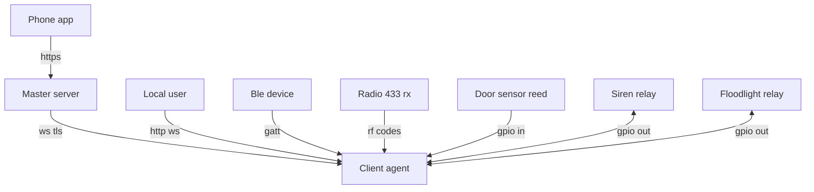
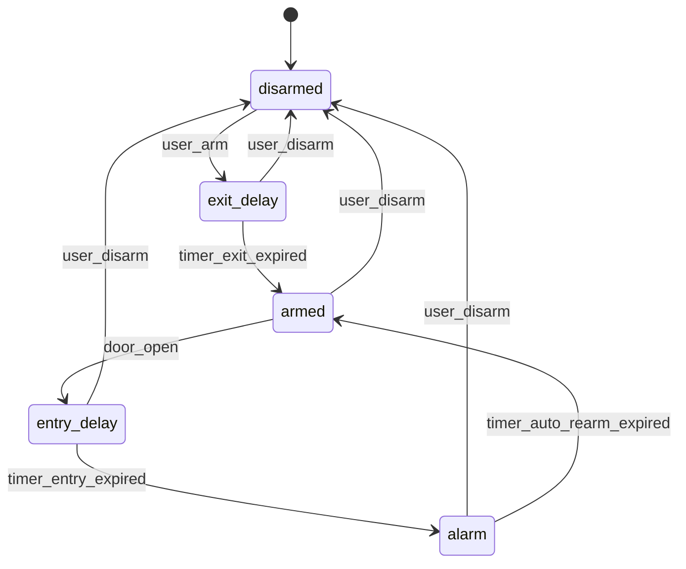

# Pi Door Security — Client Agent Technical Specification
Profile A — HTTP plus WebSocket, BLE plus 433MHz, TLS to cloud, systemd watchdog

Version: 0.1.0
Status: Draft for review
Owner: Edge client team
Applies to: Raspberry Pi client agent process
Related: [master_server/src/main.rs](master_server/src/main.rs:1), [client_server/src/main.rs](client_server/src/main.rs:1)

--------------------------------------------------------------------------------

1. Scope and goals
- Purpose: Define an implementation-ready specification for the Raspberry Pi client agent controlling door security with multi-path control and alerts.
- Primary goals
  - Always-on operation with network redundancy and graceful offline behavior.
  - Arm and disarm via multiple inputs: BLE, local LAN API and WebSocket, cloud WebSocket, and 433MHz RF remotes.
  - Monitor door reed sensor; manage state machine and timers; drive siren and floodlight relays; notify cloud on alarms.
  - Secure-by-default local interface; end-to-end TLS 1.3 to cloud; durable event queue while offline.
- Non-goals
  - Over-the-air updates and LTE modem enablement beyond documentation are out of scope for v1.
  - 433MHz transmission is out of scope for v1; receive only.

2. System context
- Actors
  - Local user: Operator on the same LAN as the Pi.
  - Cloud master: Master server receiving events and issuing commands to the client.
  - BLE device: Phone or fob connected over Bluetooth Low Energy.
  - RF remote: 433MHz simple code remote for limited actions.
  - Hardware: Door magnetic reed switch input; GPIO relays for siren and floodlight.
- High-level data flows
  - Local control: HTTP REST for commands and status; WebSocket for realtime events and commands.
  - Cloud control: Persistent TLS WebSocket with authentication and offline buffering.
  - BLE: GATT service allowing arm, disarm, and status under secure pairing.
  - RF: Receive codes and map to configured actions subject to policy.



3. Glossary
- Arm: System is armed and will alarm on unexpected door open after entry delay.
- Disarm: System is disarmed and will not alarm; auto-rearm can re-enter armed after timeout.
- Exit delay: Grace period after arming before system is fully armed.
- Entry delay: Grace period after door open to allow disarm before siren and alarm.
- Auto-rearm: Automatic return to armed from disarmed after a configured timeout.
- Event: Immutable record of a state change or signal (e.g., door_open, armed, alarm_triggered).

4. Non-functional requirements
- Availability: Target 99.9 percent for process uptime; automatic recovery on crash or hang.
- Durability: Do not lose events while offline up to 7 days or 10k events, whichever comes first.
- Security: TLS 1.3 to cloud; least-privilege local access; secrets stored root-only 600.

5. Hardware platform and I and O mapping
- Device: Raspberry Pi 4B 2 GB or higher, Raspberry Pi OS Lite 64-bit.
- GPIO mapping defaults (configurable)
  - reed_in: BCM17 pin 11, input, pull-up enabled, active low means door closed. Config flag reed_active_low to invert logic.
  - siren_relay_out: BCM27 pin 13, output, active high, default low on boot and on crash fail-safe.
  - floodlight_relay_out: BCM22 pin 15, output, active high, default low.
  - radio433_rx_in: BCM23 pin 16, input; used by 433MHz receiver data pin.
- Electrical behavior
  - Debounce reed input with 50 ms default.
  - On process start and on abnormal termination, outputs must be driven to safe low within 200 ms.
- BLE: Built-in Bluetooth controller; BlueZ stack.
- RF: Generic 433MHz ASK receiver supported; EV1527 and PT2262 codes.

6. Network redundancy and connectivity
- Interfaces and priority
  - Ethernet: Preferred when carrier is up.
  - WiFi: Fallback when Ethernet down or not present.
  - LTE USB modem: Optional; documented but disabled by default.
- Reachability and selection
  - Connectivity manager monitors default route and link status; selects interface by priority when multiple are available.
  - Cloud availability measured by periodic heartbeat success; on consecutive failures, switch to next interface if available.
- Backoff and retry
  - Exponential backoff with full jitter: base 1 s, factor 2, max 60 s; reset after 60 s stable connection.

Connectivity matrix
- Local REST and WebSocket: Operate regardless of internet; subject to local auth.
- Cloud WebSocket: Requires internet; queues events offline and replays when online.
- BLE: Operates regardless of internet.
- RF: Operates regardless of internet.

7. State machine
States
- disarmed
- exit_delay
- armed
- entry_delay
- alarm

Timers defaults
- exit_delay_s: 30
- entry_delay_s: 30
- auto_rearm_s: 120
- siren_max_s: 120

Events
- user_arm source local ws cloud ble rf
- user_disarm source local ws cloud ble
- door_open door_close
- timer_exit_expired
- timer_entry_expired
- timer_auto_rearm_expired
- timer_siren_expired
- connectivity_online connectivity_offline



Transition rules
- user_arm in disarmed starts exit_delay timer.
- user_disarm in any state returns to disarmed and cancels active timers; auto-rearm timer starts if configured greater than zero.
- door_open in armed starts entry_delay; door_close during entry_delay does not cancel alarm progression.
- timer_entry_expired triggers alarm; siren and floodlight outputs set to on; siren_max_s limits sound duration.
- auto_rearm_s greater than zero in disarmed starts countdown to armed via exit_delay.

8. Local HTTP REST API
- Base path: /v1
- Transport: HTTP over TCP on configurable port (default 8080); bind 0.0.0.0 by default for simplicity.
- Auth: none in MVP; endpoints are open on LAN; CORS disabled by default.
- Framework: Axum minimal router and handlers; no custom middleware layers; straightforward JSON request/response.

Endpoints
- GET /v1/health
  - 200 OK: {"status":"ok","ready":true,"uptime_s":123,"version":"0.1.0"}
- GET /v1/status
  - 200 OK: {"state":"armed","door":"open","timers":{"exit_s":0,"entry_s":30,"auto_rearm_s":120},"actuators":{"siren":false,"floodlight":true},"connectivity":{"cloud":"online","iface":"eth0"},"last_events":[...]}
- POST /v1/arm
  - Body optional: {"exit_delay_s":30}
  - 202 Accepted: {"state":"exit_delay","exit_delay_s":30}
- POST /v1/disarm
  - Body optional: {"auto_rearm_s":120}
  - 202 Accepted: {"state":"disarmed","auto_rearm_s":120}
- POST /v1/siren
  - Body: {"on":true,"duration_s":60}
  - 202 Accepted: {"actuators":{"siren":true},"duration_s":60}
- POST /v1/floodlight
  - Body: {"on":true,"duration_s":600}
  - 202 Accepted: {"actuators":{"floodlight":true},"duration_s":600}
- GET /v1/config
  - 200 OK: returns effective config with secrets redacted
- PUT /v1/config
  - Body: full or partial config; validated and persisted to disk; requires restart flag
  - 202 Accepted: {"applied":false,"restart_required":true}

9. Local WebSocket realtime
- Endpoint: /v1/ws
- Auth: none in MVP.
- Heartbeat: ping every 30 s; disconnect if no pong after 2 intervals.
- Messages: JSON lines, one object per frame.
- Implementation: Axum WebSocket upgrade with basic ping/pong; no rate limiting or connection caps.

Event messages examples
- {"type":"event","name":"door","value":"open","ts":"2025-01-01T12:00:00Z"}
- {"type":"event","name":"state","value":"armed","ts":"2025-01-01T12:00:01Z"}
- {"type":"event","name":"alarm_triggered","ts":"2025-01-01T12:00:30Z"}

Command messages examples
- {"type":"cmd","name":"arm","exit_delay_s":30,"id":"c1"}
- {"type":"cmd","name":"disarm","id":"c2"}
- {"type":"cmd","name":"siren","on":true,"duration_s":60,"id":"c3"}

Replies
- {"type":"ack","id":"c1","ok":true}
- {"type":"ack","id":"c3","ok":false,"error":"invalid_cmd"}

10. Cloud WebSocket protocol
- Transport: wss to configured cloud url; TLS 1.3; server cert validated against system trust store with optional SPKI pin.
- Auth: JWT Bearer token in Authorization header; token provisioned via config for v1; refresh prior to expiry.
- Heartbeats: client sends ping every 20 s; disconnect and reconnect on two missed heartbeats.
- Backoff: exponential full jitter 1 s to 60 s; immediate reconnect on clean close code 1012 after 5 s.
- Framing: JSON objects per message; all events and commands mirrored to cloud with additional metadata.
- Offline queue
  - Storage: disk-backed queue at data_dir events.db; append-only; fsync on segment close; bounded by max_events and max_age_days.
  - Replay: on reconnect, send oldest first, preserve order, stop on server 429 and apply backpressure.

Cloud events example
- {"type":"event","category":"door","value":"open","client_id":"pi001","ts":"2025-01-01T12:00:00Z"}
- {"type":"event","category":"alarm","value":"triggered","reason":"entry_delay_expired","client_id":"pi001","ts":"2025-01-01T12:00:30Z"}

Cloud commands example
- {"type":"cmd","name":"arm","exit_delay_s":30,"cmd_id":"x1"}
- {"type":"cmd","name":"disarm","cmd_id":"x2"}

11. BLE GATT service
- Pairing and security: LE Secure Connections with numeric passkey; MITM required; bonding required; reject legacy pairing.
- Service and characteristics
  - Service UUID: 7e1a0001-6c69-656e-7473-706563000000 (example namespace for this project)
  - Command characteristic UUID: 7e1a0002-6c69-656e-7473-706563000000; write without response; payload utf8 json, max 128 bytes
    - {"cmd":"arm","exit":30}
    - {"cmd":"disarm"}
    - {"cmd":"status"}
  - Status characteristic UUID: 7e1a0003-6c69-656e-7473-706563000000; notify; payload utf8 json
    - {"state":"armed","door":"closed"}
- Pairing mode: disabled by default; enable for 120 s via local API POST /v1/ble/pairing {"enable":true,"seconds":120}

12. 433MHz RF remote
- Supported encodings: EV1527 and PT2262 and similar fixed code remotes.
- Debounce: ignore repeats within 500 ms.
- Security policy
  - allow_433_disarm default false; by default remotes cannot disarm.
  - Allowed actions for RF by default: arm, floodlight on off.
- Mapping configuration
  - mappings: list of {code, action, args}; codes as hex or integer string.
- Example events
  - {"type":"event","category":"rf","code":"0x1A2B3C","action":"arm"}

13. Configuration schema and defaults
- File format: TOML
- Locations and precedence
  - Built-in defaults
  - /etc/pi-door-client/config.toml
  - Environment variables override selected keys
- Secrets
  - JWT stored in /etc/pi-door-client/secret.env owned by root mode 600

Example config toml
```toml
[system]
client_id = "pi001"
data_dir = "/var/lib/pi-door-client"
log_level = "info"

[network]
prefer = ["eth0", "wlan0"]
enable_lte = false

[http]
listen_addr = "0.0.0.0:8080"

[ws_local]
enabled = true

[cloud]
url = "wss://api.example.com/client"
spki_pins = []
heartbeat_s = 20
backoff_min_s = 1
backoff_max_s = 60
queue_max_events = 10000
queue_max_age_days = 7

[gpio]
reed_in = 17
reed_active_low = true
siren_out = 27
floodlight_out = 22
radio433_rx_in = 23
debounce_ms = 50

[timers]
exit_delay_s = 30
entry_delay_s = 30
auto_rearm_s = 120
siren_max_s = 120

[ble]
enabled = true
pairing_window_s = 120

[rf433]
enabled = true
allow_disarm = false
debounce_ms = 500
mappings = [
  { code = "0xA1B2C3", action = "arm" },
  { code = "0xA1B2C4", action = "floodlight", args = { on = true, duration_s = 600 } }
]
```

Environment variables
- PI_CLIENT_JWT for cloud bearer
- PI_CLIENT_CONFIG to override config path

14. Security model
- Cloud
  - TLS 1.3 required; disable TLS 1.0 to 1.2; validate hostname and cert chain; optional SPKI pinning.
  - JWT bearer with exp less than or equal to 24 h; include claims iss aud sub client_id; reject tokens with clock skew greater than 60 s.
- Local
  - API key required by default; randomized 32 chars; transmitted in header X-API-Key only over LAN.
  - LAN allowlist blocks non-rfc1918 subnets unless explicitly allowed.
  - CORS disabled by default.
- Secrets storage
  - root owned mode 600; never printed in logs; rotate by writing new file and sending SIGHUP.
- Hardening
  - Drop privileges to dedicated user pi-client after binding sockets.
  - Seccomp and capability reduction optional profile documented.

15. Reliability and operations
- Process supervision
  - systemd service with Restart always and WatchdogSec 30; use sd_notify to keep-alive.
- Health and readiness
  - /v1/health returns ready only after outputs initialized and event queue opened.
- Time sync
  - Requires NTP; failsafe tolerates clock drift up to plus or minus 60 s for JWT checks.
- Log management
  - Structured logs to journald; optional file sink with rotation to data_dir logs.
- Storage resilience
  - Queue segments rotate every 10 MB; fsync per segment; protect from disk full by oldest drop policy with warning.

Example systemd unit
```ini
[Unit]
Description=Pi Door Client Agent
After=network-online.target time-sync.target
Wants=network-online.target

[Service]
User=pi-client
Group=pi-client
ExecStart=/usr/local/bin/pi-door-client --config /etc/pi-door-client/config.toml
EnvironmentFile=-/etc/pi-door-client/secret.env
Restart=always
RestartSec=2s
WatchdogSec=30s
Type=notify
NoNewPrivileges=true
ProtectSystem=full
ProtectHome=true
PrivateTmp=true
CapabilityBoundingSet=

[Install]
WantedBy=multi-user.target
```

16. Observability
- Logs: JSON lines with keys ts level msg component client_id state door connectivity.
- Metrics optional: expose Prometheus on localhost at /metrics when enabled.
- Audit log: append-only event ledger mirrored to cloud.

Example log line
- {"ts":"2025-01-01T12:00:00Z","level":"info","msg":"door open","component":"sensor","state":"armed","door":"open"}

17. Failure modes and handling
- Network loss: continue local and BLE and RF; queue cloud events; backoff reconnect.
- Sensor stuck: detect no transitions over long period if expected; log warning; do not block arming.
- Storage full or corruption: switch to memory queue up to 100 events; surface degraded status; attempt repair; never crash.
- Clock drift: accept up to 60 s; beyond that mark cloud auth invalid and report not ready.
- Process crash or hang: restarted by systemd; watchdog terminates unresponsive process after 30 s.

18. Acceptance criteria and test plan
- Functional
  - Arm disarm via local REST and local WS and BLE and RF as permitted.
  - State machine transitions conform to diagram and timers within plus or minus 5 percent.
  - Alarm triggers siren and floodlight; siren stops at siren_max_s.
- Resilience
  - Internet flap test: while generating events, disconnect for 10 minutes then reconnect; 100 percent of events delivered in order.
  - Process kill test: kill minus nine; on restart fail-safe outputs off; state restored from persisted snapshot or defaults; no duplicate alarms.
- Security
  - Cloud connects only with TLS 1.3 and valid cert; JWT expiry enforced.

19. Out of scope and future work
- OTA updates with signed artifacts and rollback.
- LTE modem enablement and monitoring.
- 433MHz transmit support and rolling code remotes.
- Rules engine and multi zone support.
- Multi sensor inputs and tamper switch.

20. Appendices
A. Data schemas
- Event common fields: id uuid v4, ts rfc3339, source local ws cloud ble rf, category, value, attrs map.
- Status shape identical between local and cloud with additional client_id on cloud.

B. Operational commands
- SIGHUP reload configuration and rotate logs; SIGTERM graceful shutdown within 5 s.

C. Security hardening references
- systemd sandboxing recommendations for network daemons.

--------------------------------------------------------------------------------

21. Implementation stack for local server (Axum)
- Language and runtime
  - Rust edition 2024
  - Async runtime: Tokio multi-thread
- HTTP and WebSocket server
  - Framework: Axum for routing, request extraction, and WebSocket handling
  - HTTP versions: support HTTP/1.1; HTTP/2 optional if TLS termination is provided upstream
  - Bind address: from config http.listen_addr; can restrict to loopback for hardened deployments
- Middleware and layers
  - None for MVP; use Axum extractors only and a simple error handler; CORS disabled by default
- Routing layout
  - GET /v1/health
  - GET /v1/status
  - POST /v1/arm
  - POST /v1/disarm
  - POST /v1/siren
  - POST /v1/floodlight
  - GET /v1/config
  - PUT /v1/config
  - POST /v1/ble/pairing
  - GET /v1/ws
- Error model
  - Errors return JSON: {"error":"string","code":integer}
  - Use 4xx for client errors and 5xx for server faults; include retryable:true when safe to retry
- Graceful startup and shutdown
  - On startup, initialize GPIO to safe state, open event queue, then start server
  - On SIGTERM, stop accepting new connections, drain in-flight requests for up to 5 s, then shut down
- Observability
  - Emit structured logs per request with method, path, status, latency_ms, remote_ip, user_agent, request_id
  - Optionally expose Prometheus metrics on localhost only at /metrics
- Security hardening
  - Drop privileges to service user after binding; sanitize headers; filter hop-by-hop headers

Assumptions and open items
- BLE UUIDs are provisional and can be replaced with final namespace before implementation.
- Local authentication and allowlisting are out of scope for MVP and may be added later if needed.
- Radio remote disarm remains disabled by default and requires explicit enable with risk acceptance.

